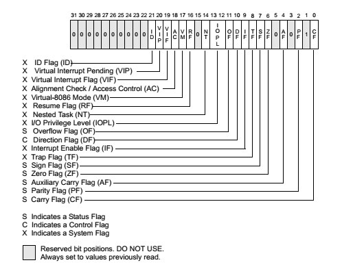

## **EFLAGS**

    

### **EFLAGS Types**

This is a **32-bit register** in **x86 assembly** language that contains various flags providing information about the result of an operation. These flags are crucial for understanding the outcome of **arithmetic operations** and determining the **next steps in the program flow**.

| Flags | Description |
|:------|:------------|
| `CF`  | Carry flag, set when an arithmetic operation generates a carry or borrow. |
| `OF`  | Overflow flag, set when an operation generates a result too large for the destination register. |
| `SF`  | Sign flag, set when the result of an operation is negative. |
| `ZF`  | Zero flag, set when the result of an operation is zero. |
| `AC`  | Alignment check flag, set when an unaligned memory access occurs. |
| `PF`  | Parity flag, set when the least-significant byte of the result has an even number of set bits. |
| `IF`  | Interrupt flag, determines whether the CPU recognizes external interrupts. |

{: .important-title }
If the flag is set to `1`, it means the condition is met; otherwise, it's `0`. You can check more register flags [here](https://en.wikipedia.org/wiki/FLAGS_register).