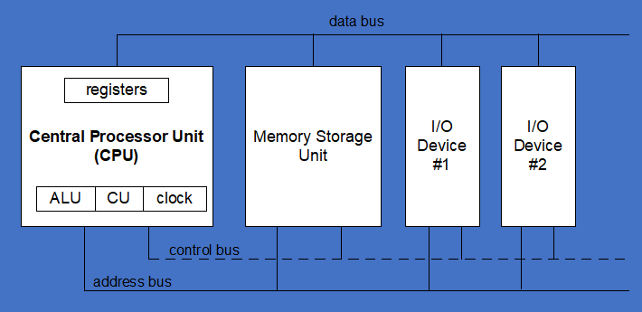
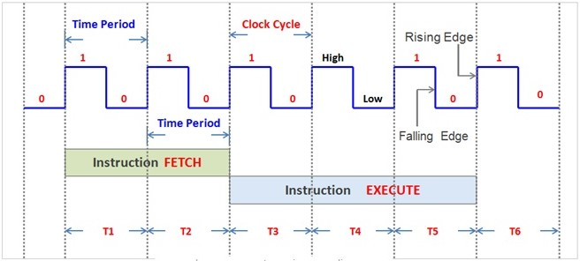

## **X86 PROCESSOR ARCHITECTURE**

    

### **Processor Architecture Overview**

Basic components of the x86 processor in relation to other hardware elements within the system:

- **CPU**: The central processing unit, responsible for executing instructions.
- **Memory**: Stores data and instructions for the CPU to access.
- **I/O Devices**: Input/output devices such as monitors, keyboards, and mice.

----

### **Communication Channels**

Communication between these components occurs through three primary buses:

1. **Control Bus**: Synchronizes actions among attached devices, facilitating coordination.
2. **Address Bus**: Holds the address of instructions and data during transfers.
3. **Data Bus**: Transfers instructions and data between the CPU, memory, and I/O devices.

----

### **CPU Components**

The CPU comprises several crucial components:

- **ALU (Arithmetic Logic Unit)**: Performs arithmetic and logical operations such as ADD, AND, OR, NOT, etc.
- **Control Unit**: Decodes instructions and directs operations to other CPU units or external devices.
- **Clock**: Generates regular pulses to synchronize operations within the CPU and across the system.
- **Memory Registers**: Fastest storage locations within the CPU used for temporary data storage and manipulation.

    

- Measured in Hertz, the clock speed determines the number of instructions a CPU can execute per second.
- One to zero and back to one is one clock cycle.
- The number of clock cycles per second, expressed in GHz (Gigahertz).
- Every time the clock ticks, the CPU processes an instruction.

----

### **Operation Execution**

Understanding the execution of instructions is important:

1. **Fetching**: Retrieve instructions from the instruction queue.
2. **Decoding**: Interpret the instruction and identify associated operands.
3. **Operand Retrieval**: Obtain necessary data from memory or registers.
4. **Execution**: Perform the specified operation.
5. **Status Update**: Update status flags based on the outcome of the operation.
6. **Result Storage**: Store the result if required.

{: .important-title }
This sequence, known as the **fetch-decode-execute** procedure, forms the basis of CPU operation.

----

### **Memory Access**

Reading from memory involves specific steps:

1. **Addressing**: Specify the memory address to read from.
2. **Assertion**: Signal the CPU's intent to read from memory.
3. **Waiting**: Allow time for memory to respond.
4. **Data Retrieval**: Copy data from the data bus to the destination.

{: .important-title }
Memory access (RAM) typically takes longer than register access due to the additional steps involved. Instead of executing only one instruction, we need to execute multiple instructions to access memory.

----

### **Caching**

To mitigate memory access latency, caching is employed:

- **Cache**: Stores frequently accessed data closer to the CPU, reducing read and write times.
- **Levels**: x86 architecture commonly features two cache levels:
  - **Level 1 Cache**: Located within the CPU for rapid access.
  - **Level 2 Cache**: External to the CPU but accessed via a high-speed bus, offering faster access than RAM.

{: .important-title }
Static RAM is often used in caches due to its efficiency, though it's costlier than dynamic RAM. Dynamic RAM is used in main memory due to its lower cost and higher storage capacity.